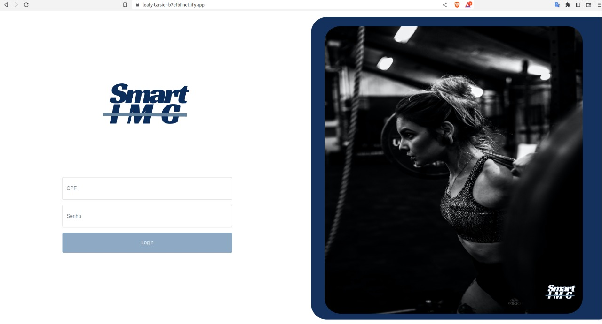
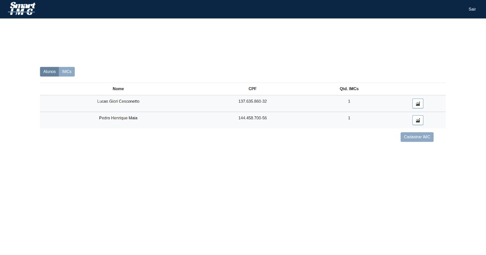
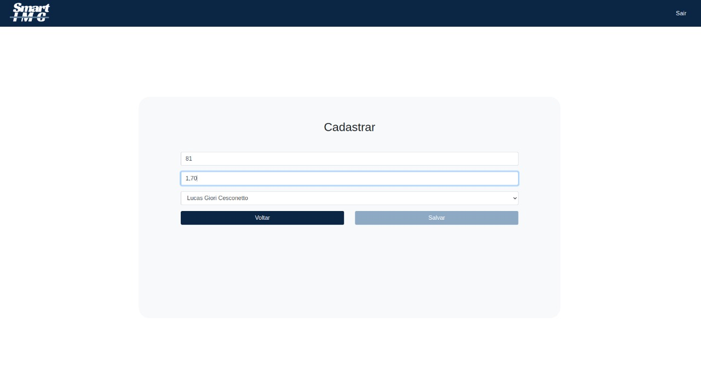
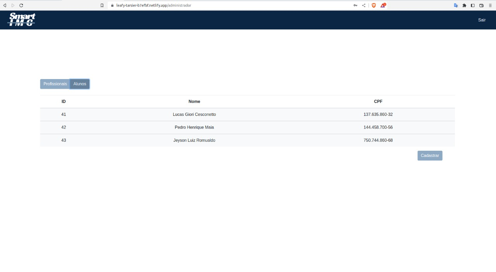
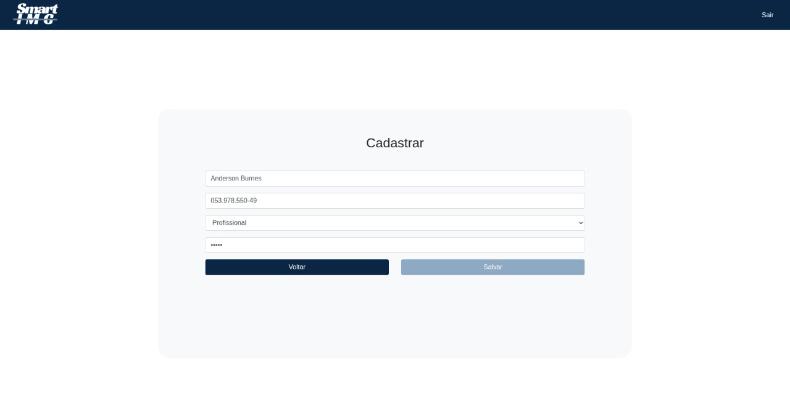
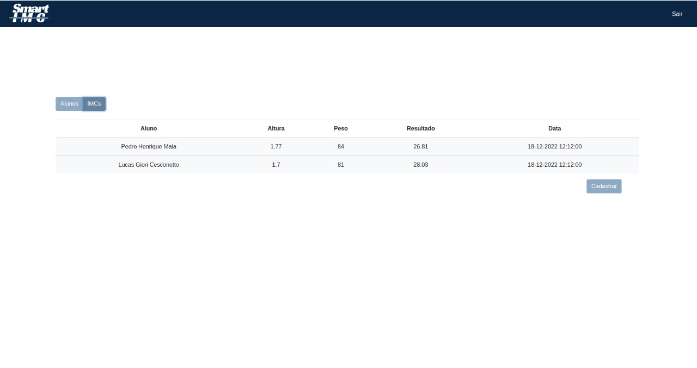
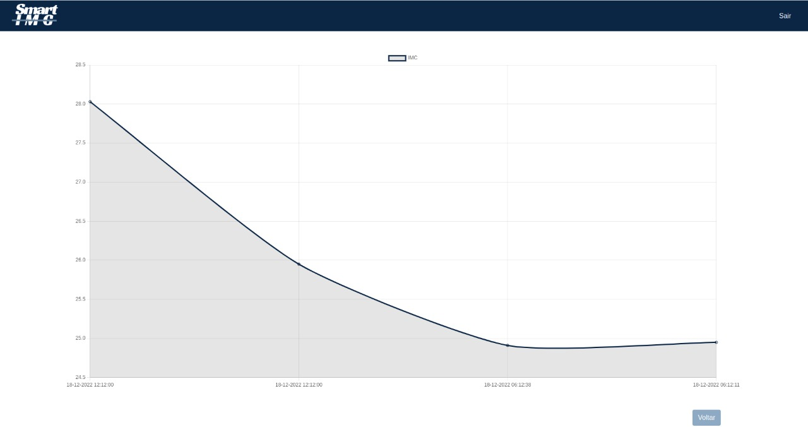
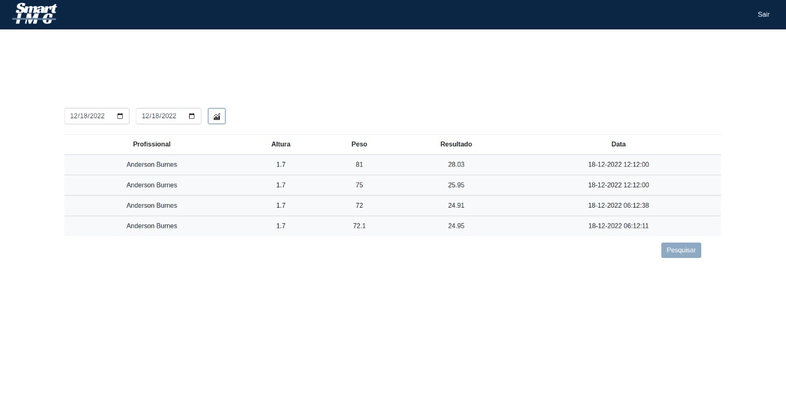

<h1 align="center">Smart IMC</h1><br>


Comandos para subir projeto local
```
$ npm install
$ npm start
```

[Smart IMC - Produção](https://leafy-tarsier-b7efbf.netlify.app/)

***
<h2 align="center">Layouts do projeto</h2><br>
<h3 align="center">(Layout de Login)</h3><br>

<br>
<br>
<h3 align="center">(Layouts do Administrador)</h3><br>
<br>
<br>
<br>
<br>
<h3 align="center">(Layouts do Profissional)</h3><br>
<br>
<br>
<br>
<br>
<h3 align="center">(Layouts do Aluno)</h3><br>
<br>
<br>


***
[Protótipo do Admin](https://www.figma.com/proto/ICpQXVHijGgshlJ9JkymqJ/login?node-id=1%3A6&scaling=scale-down&page-id=0%3A1&starting-point-node-id=1%3A6) |
[Protótipo do Profissional](https://www.figma.com/proto/ICpQXVHijGgshlJ9JkymqJ/login?node-id=30%3A538&scaling=scale-down&page-id=30%3A465&starting-point-node-id=30%3A538) |
[Protótipo do Aluno](https://www.figma.com/proto/ICpQXVHijGgshlJ9JkymqJ/login?node-id=30%3A778&scaling=scale-down&page-id=30%3A704&starting-point-node-id=30%3A778)